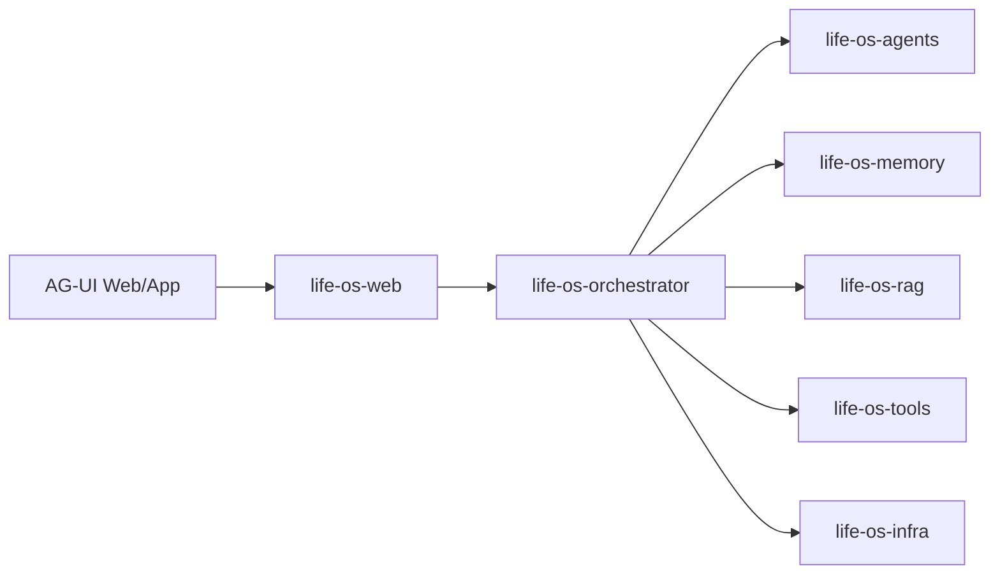

# Life OS Architecture

## Runtime Layout

## Executable Module Facades

- `MemoryModuleFacade.execute(...)`
- `KnowledgeModuleFacade.execute(...)`
- `ToolModuleFacade.execute(...)`
- `TravelAgent.execute(...)`
- `LearningAgent.execute(...)`
- `ScheduleAgent.execute(...)`
- `LifeOrchestrator.execute(...)`
- `InfrastructureModuleFacade.executeDemo()`
- `WebModuleFacade.executeDemo()`

## Why This Shape

- We keep the first cut monolithic to reduce integration cost.
- Each module has a small public facade so later AgentScope-specific implementations can swap in behind the same boundary.
- The orchestrator already models the target product flow: input -> routing -> contribution synthesis -> plan -> confirmation.
