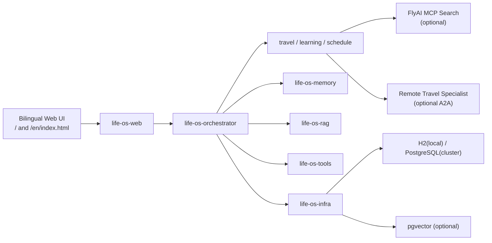
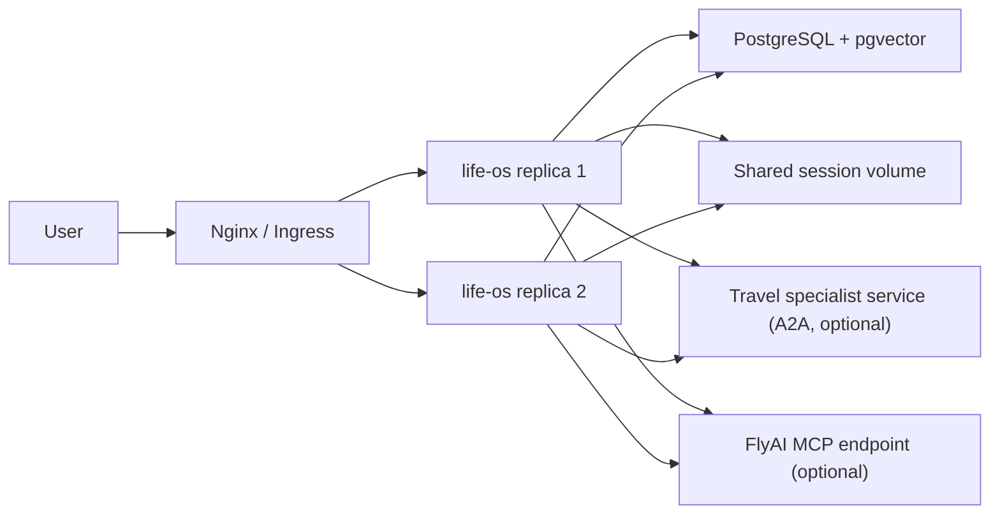

# Life OS 架构说明

## 1. 当前形态

当前代码形态是“**模块化单体 + 可横向扩展部署 + 可外接远程 specialist**”。

这样做的原因很直接：

- 一期先把产品闭环跑通，降低集成复杂度
- 通过领域接口和模块 facade 保留后续拆服务空间
- 先把状态外置到数据库，再做多副本部署才有意义
- 把旅行搜索和旅行专家能力预留成外部能力位

## 2. 运行时架构

## 3. 集群形态

## 4. 为什么采用这套架构

### 4.1 产品与工程节奏匹配

- 对 Demo 来说，业务演示链路比微服务数量更重要
- 对后续演进来说，模块边界比“先拆服务”更重要

### 4.2 为什么主编排器先不拆

- 主编排负责计划生成、确认流、记忆、知识拼装
- 这部分对事务一致性和状态写入要求更高
- 先保留本地编排，集成复杂度最低

### 4.3 为什么旅行能力先外接

旅行场景很适合作为第一块可拆能力：

- 既需要结构化建议，也需要实时搜索
- 既有本地知识，也有外部动态信息
- 可以先通过 FlyAI 强化搜索，再通过 A2A 强化垂类专家建议

## 5. 数据与状态

### 5.1 事务型数据

默认落库对象：

- `user_profiles`
- `life_plans`
- `confirmation_requests`
- `execution_runs`
- `knowledge_documents`

### 5.2 检索数据

- 文本内容保存在关系库
- 启用向量模式时，同步写入 pgvector
- 查询时做 hybrid merge

### 5.3 会话状态

当前集群 Demo 采用：

- `JsonSession`
- 共享卷挂载

后续推荐升级方向：

- `Redis Session`
- 或 AgentScope 提供的数据库 Session 方案

## 6. Agent 拓扑

### 主控 Agent

- 接收用户复合目标
- 拆成子任务
- 调度专家 Agent
- 生成结构化计划
- 产生人工确认节点

### 专家 Agent

- `TravelAgent`
- `LearningAgent`
- `ScheduleAgent`

### 外接专家

- `TravelA2aAdvisor`
  - 用于远程旅行 specialist
- `FlyAiSearchConnector`
  - 用于旅行搜索增强

每个模块都保留了 `execute(...)` 或 `executeDemo()` 入口，用于单模块验证和后续服务化改造。
