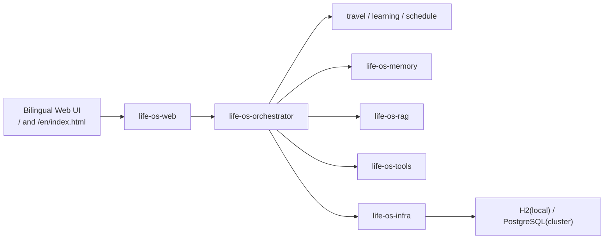
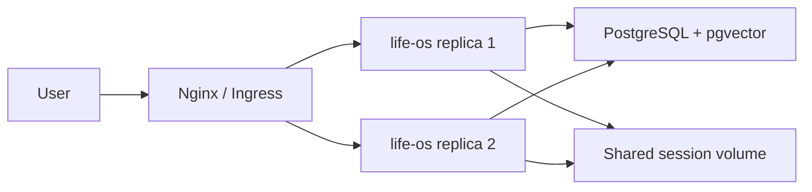

# Life OS 架构说明

## 1. 当前形态

当前代码形态是“**模块化单体 + 可横向扩展部署**”。

这样做的原因很直接：

- 一期先把产品闭环跑通，降低集成复杂度
- 通过领域接口和模块 facade 保留后续拆服务空间
- 先把状态外置到数据库，再做多副本部署才有意义
- 保留 AgentScope 的 `AG-UI`、`ReActAgent`、`Session`、`Toolkit` 接入点

## 2. 运行时架构

## 3. 集群形态

## 4. 为什么采用这套架构

### 4.1 产品与工程节奏匹配

- 对 Demo 来说，业务演示链路比微服务数量更重要
- 对后续演进来说，模块边界比“先拆服务”更重要

### 4.2 为分布式做了哪些提前准备

- 业务状态从内存迁移到数据库
- UI、编排、工具、知识库、记忆都通过清晰接口连接
- `application-cluster.yml`、`Dockerfile`、`docker-compose`、`k8s` 清单已经补齐
- 会话目录可外置到共享挂载路径

### 4.3 为什么还没有一步拆成 A2A 微服务

这是一个刻意的阶段选择：

- 当前最先需要验证的是“完整产品闭环”
- 真实 A2A 拆分需要引入服务注册、跨服务追踪、重试与幂等
- 等主闭环稳定后，再将 `travel-agent`、`learning-agent`、`schedule-agent` 升级为独立 Agent 服务更合适

## 5. 数据与状态

### 5.1 事务型数据

默认落库对象：

- `user_profiles`
- `life_plans`
- `confirmation_requests`
- `execution_runs`
- `knowledge_documents`

### 5.2 会话状态

当前集群 Demo 采用：

- `JsonSession`
- 共享卷挂载

原因：

- 代码简单
- 保持和 AgentScope Session 机制一致
- 便于先把多副本跑通

后续推荐升级方向：

- `Redis Session`
- 或者 AgentScope 提供的数据库 Session 方案

## 6. Agent 拓扑

### 主控 Agent

- 接收用户复合目标
- 拆成子任务
- 调度专家 Agent
- 生成结构化计划
- 产生人工确认节点

### 专家 Agent

- `TravelAgent`
- `LearningAgent`
- `ScheduleAgent`

每个模块都保留了 `execute(...)` 或 `executeDemo()` 入口，用于单模块验证和后续服务化改造。
