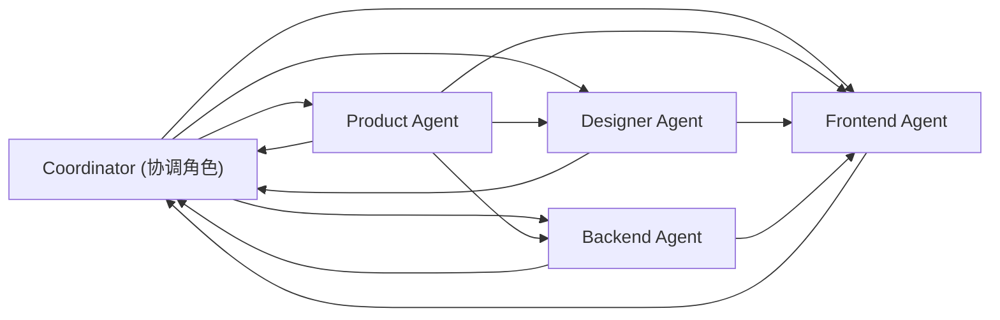

# 四职能多 Agent 开发工作流

## 目标

把“产品、设计、前端、后端”从串行协作升级为并行协作，在不牺牲一致性的前提下提升交付效率与专精度。

适用范围：

- 跨模块改造（ToC + ToB + API + 编排）
- 有明确验收要求与监测指标的迭代
- 预计持续超过 1 天的开发任务

## 协作拓扑



## 四职能职责

1. Product Agent
- 明确范围、非目标、优先级、上线策略。
- 输出验收标准和业务指标。

2. Designer Agent
- 定义信息架构、交互流、动效节奏、双语文案规则。
- 输出关键状态（空、加载、错误、成功）行为规范。

3. Frontend Agent
- 落地 ToC/ToB 页面与交互逻辑。
- 保证移动端 H5 可用性与埋点可追踪性。

4. Backend Agent
- 落地 API、Agent 编排、RAG、FlyAI/A2A 等后端能力。
- 输出链路可观测性（sessionId/contextId/traceId 对齐）。

## 运行步骤（可执行）

### 1) 启动团队 runtime

```bash
bash scripts/omx/four-agent/start-team.sh \
  --goal "本轮迭代目标描述"
```

如果你已经有 team，也可以跳过这一步。

### 2) 注入四职能任务卡

```bash
bash scripts/omx/four-agent/bootstrap.sh \
  --team <team-name> \
  --goal "本轮迭代目标描述"
```

脚本会自动创建 4 条任务并建立依赖关系：

- 产品任务先行
- 设计依赖产品
- 后端依赖产品
- 前端依赖产品 + 设计

并默认向 `worker-1..worker-4` 写入角色 inbox（可 `--no-inbox` 关闭）。

### 3) 查看协作状态

```bash
bash scripts/omx/four-agent/status.sh --team <team-name>
```

可输出总任务、进行中、已完成、依赖情况和每条任务状态。

## 协调角色（建议）

协调角色不是第五个开发 agent，而是交付守门角色，负责：

- 每轮对齐目标与风险（开始前 5 分钟）
- 每天两次看板巡检（中午 + 收工前）
- 解决跨角色冲突（接口、字段、验收口径）
- 收敛验收并决定是否合并

## 验收门禁

1. 功能门禁
- ToC 主动线完整可操作
- ToB 监控面能看到关键运行状态

2. 数据门禁
- 关键埋点有稳定 schema
- 追踪 ID 可串联请求与确认流

3. 工程门禁
- `mvn test`
- `mvn -DskipTests install`
- 关键路径冒烟通过

## 指标建议

用于衡量“多 Agent 是否真的提升效率”：

- 需求到提测周期（Lead Time）
- 缺陷回滚率（Rollback Ratio）
- 验收一次通过率（First-pass Acceptance）
- 任务阻塞时间占比（Blocked Time Ratio）
- 用户关键动线完成率（ToC Completion Rate）

