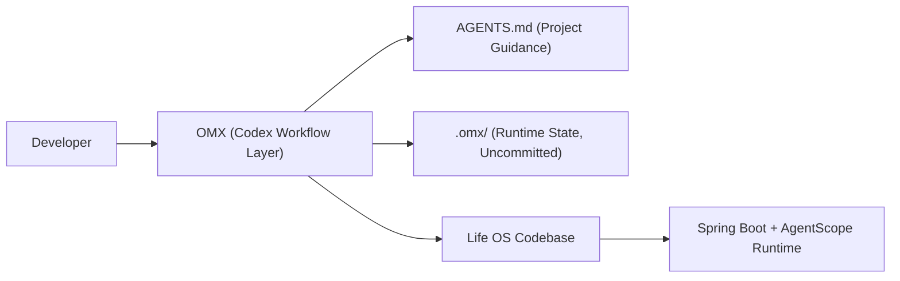

# oh-my-codex 接入说明

## 接入目标

`oh-my-codex (OMX)` 在本项目中定位为“研发协作执行层”，不是线上业务运行时依赖。

- 不影响 `agentscope-java` 的生产执行链路。
- 主要增强需求澄清、计划审批、并行执行和交付闭环效率。
- 通过项目级 `AGENTS.md` 约束产品定位与工程质量门禁。

## 接入后的工程结构



## 已落地内容

- 根目录新增 `AGENTS.md` 作为项目级执行约束。
- 新增脚本：
  - `scripts/omx/setup-project.sh`
  - `scripts/omx/start.sh`
  - `scripts/omx/doctor.sh`
- `.gitignore` 增加：
  - `.omx/`
  - `.omx-worktrees/`

## 使用方式

### 1) 首次初始化

```bash
bash scripts/omx/setup-project.sh
```

脚本会做以下动作：

1. 校验 `Node.js >= 20`。
2. 自动补齐 `@openai/codex` 与 `oh-my-codex` 全局安装。
3. 执行 `omx setup --scope project --force`。
4. 执行 `omx doctor` 做基础诊断。

### 2) 启动 OMX 会话

```bash
bash scripts/omx/start.sh
```

默认等价于：

```bash
omx --madmax --high
```

也可以透传自定义参数：

```bash
bash scripts/omx/start.sh --xhigh
```

### 3) 常用执行流（建议）

```text
$deep-interview "澄清当前需求范围与非目标"
$ralplan "输出实现方案并审批关键取舍"
$ralph "按已审批方案持续执行到完成"
$team 3:executor "针对多模块改造并行落地"
```

## 与当前项目能力的映射

- `AGENTS.md` 中明确了 ToC/ToB 的产品边界、文案约束、移动端优先和追踪 ID 关联要求。
- OMX 产生的流程状态落在 `.omx/`，不污染业务数据库。
- 业务数据仍按现有架构写入 `PostgreSQL/pgvector` 和应用持久层。

## 验证清单

```bash
omx doctor
mvn test
mvn -DskipTests install
```

完成后访问：

- 中文 ToC: `http://127.0.0.1:8080/`
- 英文 ToC: `http://127.0.0.1:8080/en/index.html`
- ToB 运营面: `http://127.0.0.1:8080/?surface=tob`
